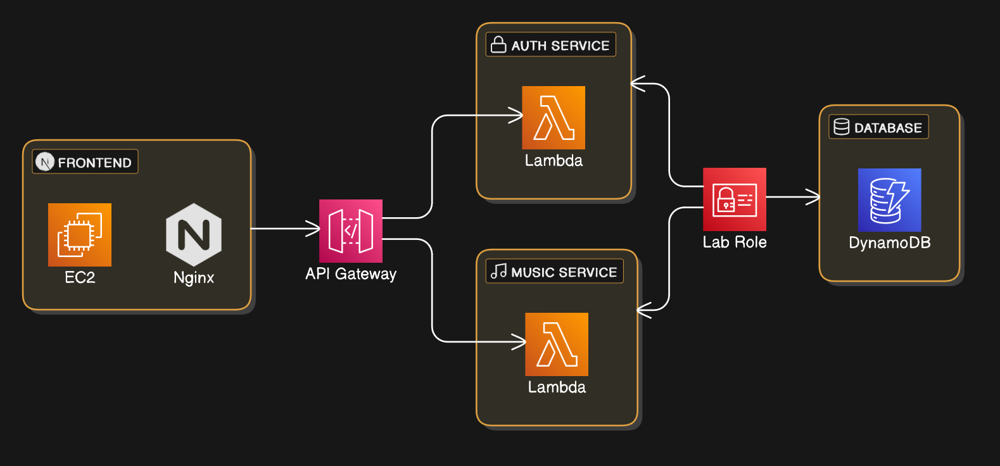

## Table of Contents

- [System Architecture Overview](#system-architecture-overview)
- [1. Frontend Layer](#1-frontend-layer)
- [2. API Gateway](#2-api-gateway)
- [3. Backend Services](#3-backend-services)
- [4. Database](#4-database)
- [Data Flow](#data-flow)
- [Deployment](#deployment)
  - [Section 1: Scripts](#section-1-scripts)
  - [Section 2: Lambda Functions](#section-2-lambda-functions)
  - [Section 3: API Gateway](#section-3-api-gateway)
  - [Section 4: EC2](#section-4-ec2)

# System Architecture Overview



This document provides an overview of the system architecture, detailing the components, their interactions, and the data flow.

## 1. Frontend Layer

- The frontend is hosted on an **Amazon EC2** instance.
- **Nginx** is deployed on this EC2 instance as a web server and reverse proxy. It handles incoming HTTP requests from users on port 80 (as per the project requirements) and forwards them to the Next.js application running on port 3000.

## 2. API Gateway

- The **API Gateway** acts as the central entry point for all client requests from the frontend to the backend. It routes incoming API calls to the appropriate backend services (Auth Service or Music Service).

## 3. Backend Services

- The backend is implemented using Python.
- Two distinct AWS Lambda-based services are deployed:
  - **Auth Service**: This service handles user authentication functionalities, such as login and signup operations.
  - **Music Service**: This service manages the core music-related functionalities of the application, such as retrieving, subscribing, unsubscribing, retrieving songs, and filtering.

## 4. Database

- **Amazon DynamoDB** is utilized as the primary database for storing application data.
- Access to DynamoDB is through a **Lab Role**, which likely refers to an AWS IAM (Identity and Access Management) role. This role defines the permissions that the Lambda functions (Auth Service and Music Service) have when interacting with DynamoDB, ensuring that only authorized operations are performed.

## Data Flow

- A user interacts with the frontend (Next.js application) via a web browser, sending HTTP requests to the EC2 instance on port 80.
- Nginx, acting as a reverse proxy, forwards these requests to the Next.js server running on port 3000.
- The frontend communicates with the backend by sending API requests to the API Gateway.
- The API Gateway routes the requests to either the Auth Service (for login/signup) or the Music Service (for music-related operations) based on the API endpoint.
- The Lambda functions (Auth Service and Music Service) process the requests, interacting with DynamoDB as needed to retrieve or store data.
- Responses from the Lambda functions are sent back through the API Gateway to the frontend.

## Deployment

The following sections describe the deployment process for each component of the system.

### Section 1: Scripts

1.  First, we set up our data source, which is DynamoDB and the S3 bucket.
    Inside the `scripts` folder, we have a script called `user_dynamo_table.py` which creates a DynamoDB table called `users` and pushes 10 random users to the table.

```bash
py user_dynamo_table.py
```

2.  Then, we have a script called `music_dynamo_table.py` which creates a DynamoDB table called `music`. It won't push any data as we need to wait for the S3 bucket to be created first, since we store the path of the music files in the DynamoDB table.

```bash
py music_dynamo_table.py
```

3.  Then, we have a script called `image_s3_uploader.py` which will create the S3 bucket with public get access and upload the images to the S3 bucket, and also push the data into the music table.

```bash
py image_s3_uploader.py
```

### Section 2: Lambda Functions

Inside the `lambda` folder, we have two files, `auth.py` and `music.py`, as mentioned above. Both of them handle their individual tasks based on the requests received from the API Gateway.

For this, we have manually pasted our code from the given file inside the Lambda, we provisioned 2 Lambdas and have done it accordingly.

### Section 3: API Gateway

The following endpoints are configured in the API Gateway:

The following endpoints are configured in the API Gateway:

- `/login` POST (Request body: JSON with `email` and `password` fields)
- `/register` POST (Request body: JSON with `username`, `email`, and `password` fields)
- `/user` GET (Parameters: `user_id` in the request)
- `/subscribed` GET (Parameters: `user_id` in the request)
- `/unsubscribe` POST (Request body: JSON with `user_id`, `artist`, `album`, `title`, and `year` fields)
- `/search` POST (Request body: JSON with `title`, `artist`, `album`, and `year` fields)

### Section 4: EC2

1.  Install NodeJS on the EC2 instance:

    [AWS Documentation](https://docs.aws.amazon.com/sdk-for-javascript/v2/developer-guide/setting-up-node-on-ec2-instance.html)

2.  Install Git on the EC2 instance:

    [Git](https://srinirallabandi.medium.com/install-and-configure-git-in-linux-ec2-instance-41cb5921fbf3)

3.  Install Nginx on the EC2 instance:

    [Nginx](https://ubuntu.com/tutorials/install-and-configure-nginx#2-installing-nginx)

4.  Create Next.js config on Nginx:

````bash
sudo nano /etc/nginx/sites-available/nextjs
```nginx
server {
    listen 80;
    server_name <elastic ip address>;

    location / {
        proxy_pass http://localhost:3000;
        proxy_http_version 1.1;
        proxy_set_header Upgrade $http_upgrade;
        proxy_set_header Connection 'upgrade';
        proxy_set_header Host $host;
        proxy_cache_bypass $http_upgrade;
    }
}
````

Create a symbolic link:

```bash
sudo ln -s /etc/nginx/sites-available/nextjs /etc/nginx/sites-enabled/
```

Test the configuration:

```bash
sudo nginx -t
```

If the test is successful, reload Nginx:

```bash
sudo systemctl reload nginx
```

5.  Next.js configuration:
````bash
git clone <repo-url>
```bash
cd repo-directory
```bash
npm install; npm install -g pm2
```bash
npm run build
```bash
pm2 start npm --name "music-subscription-app" -- start
````
